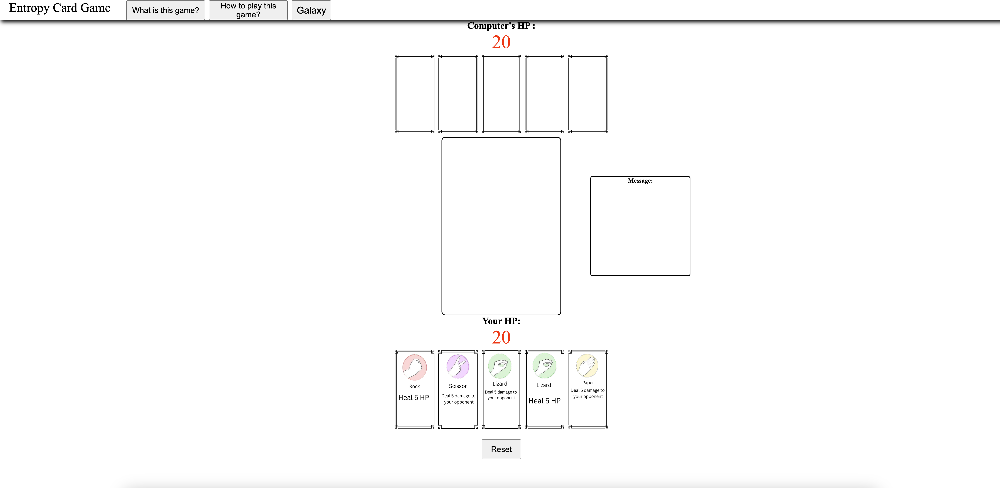
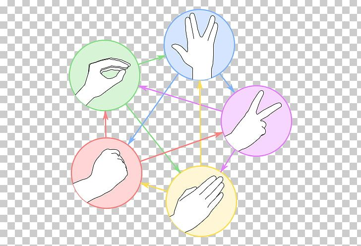

# Entropy-card-game



# Game Name: Entropy Card Game

## What is this game?
***"Rock, Paper, Scissors, Lizard, Spock,"*** made famous by ***"The Big Bang Theory,"*** is a more complex version of the classic game of rock,paper,scissor. It introduces Lizard and Spock alongside the original choices in card form. Unlike traditional Rock, Paper, Scissors, where each option has a single counterpart it defeats or is defeated by, each choice in this game interacts with multiple others. This added complexity requires players to think strategically about their moves. Additionally, each player has a ***health pool (HP)***, and the goal is to reduce the opponent's HP to zero by playing cards strategically, winning rounds, and activating card effects.

## Game Rules

Each player choose a card and reveal it simultaneously. 
The Player picks the card by clicking on the card.
The outcome is determined based on specific rules:
1. Scissors cut Paper
2. Paper covers Rock
3. Rock crushes Lizard
4. Lizard poisons Spock
5. Spock smashes Scissors
6. Scissors decapitates Lizard
7. Lizard eats Paper
8. Paper disproves Spock
9. Spock vaporizes Rock
10. Rock crushes Scissors

If both players choose the same card, it results in a tie, and they continue until a winner emerges.The winner is determined by who is left standing (player that still has HP).A visual representation of the game's rules can be seen below.


## Why I chose this game as my project?

I chose this game because I wanted to expand on the rock, paper scissor logic and wanted to make the game my version by layering a card element on top. I have always been fascinated by Hearthstone (Digital collectable card game) and the game mechanic behind it.

## Getting started?
[Deployed Game link](https://eddiec97.github.io/Entropy-card-game/)
[Planning Game Link](https://github.com/EddieC97/Entropy-card-game/blob/main/Planning.md)

## Attributions: 
[Short Unique ID (UUID) Generating Library](https://www.jsdelivr.com/package/npm/short-unique-id) \
[Rock,Paper,Scissor,Spock,Lizard](https://www.pngwing.com/en/free-png-ycasl)

## Technology used 
**JavaScript**\
**HTML**\
**CSS**\

## Next Steps:
1. Adding more variety of cards with new effect (draw 2, opponent draw 2 ,see opponent hand)
2. Adding more background theme 
3. Allowing for 2 person play across a server
4. History of cards played and effect triggered


## What I learned:

```JavaScript
function toggleWhatGamePopup() {
    let popupGame = document.getElementById("popupGame")
    // popupGame.style.visibility =
    (popupGame.style.visibility ==="visible") ?  "hidden" :         "visible"
    //        |                                       |               |
    // this ask the question if the pop up is      if visible       if hidden then turn visible
    // visible                                    then turn hidden
}
```
Object.assign(): https://developer.mozilla.org/en-US/docs/Web/JavaScript/Reference/Global_Objects/Object/assign
Create a shallow copy of each card from the CHOICES array, and combine with the cardId object above.
You then push this new object, cardCopy, into the deckArray.


```JavaScript
function createDeck(numberCopies) {
  let deckArray = [];

  for (let choiceIndex = 0; choiceIndex < CHOICES.length; choiceIndex++) {
    for (let cardCounter = 0; cardCounter < numberCopies; cardCounter++) {
      //00 --> Rock/Damage [0] Card Copy Number [0]
      //01 -->Rock/Damage [0] Card Copy Number [1]
      //02
      //03
      //04
      //10
      //11
      //12
      //13
      //14


      //1. Create an object with a unique id
      //Generate ID           Original Card Index    copied card index
      //    /                         /                 /
      let cardId = { id: uid.rnd() };

      //2. Take the object and and copy its properties into a target object (The card you are copying)
      // copied card               generated card with ID     original card
      //      /                        /                       /
      let cardCopy = Object.assign(cardId, CHOICES[choiceIndex]);

      // 3. Take the copied cards and push them into the deckArray
      // Final deck      copied card
      //    /               /
      deckArray.push(cardCopy);
    }
  }
  return shuffleDeck(deckArray);
}
```


